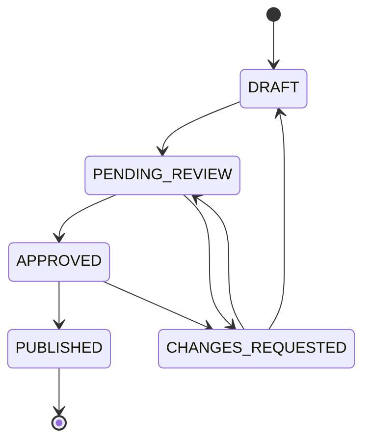

# DevFlow MCP Server 产品文档

## 产品概述

DevFlow MCP Server 是一个面向 AI 的开发流程管控 MCP（Model Context Protocol）服务，专为规范化 AI 驱动的软件开发流程而设计。该系统通过严格的流程控制，引导 AI 按照标准化路径执行开发任务：从任务文档创建 → 人工审核 → 代码生成 → 测试验证 → 文档生成 → Jira 工单提交，确保开发过程的可追溯性和质量保证。

### 核心价值

- **流程标准化**：建立统一的开发流程规范，确保每个任务都经过完整的生命周期
- **AI 友好设计**：专门为 AI 开发场景优化，提供清晰的指导和约束
- **完整集成**：内置 MySQL、Jira 等常用工具的完整实现，无需外部依赖
- **文档驱动**：以文档为中心，自动生成和维护完整的开发文档
- **质量保证**：通过状态机和人工审核确保开发质量

## 产品架构

### 技术栈
- **语言**: Python 3.10+
- **框架**: FastMCP (Model Context Protocol)
- **数据模型**: Pydantic
- **文档处理**: python-frontmatter, PyYAML
- **数据库**: PyMySQL (MySQL)
- **API 集成**: requests (Jira REST API)
- **UI 展示**: rich (命令行界面)

### 系统架构
```
DevFlow MCP Server
├── 核心服务层 (devflow_mcp/server.py)
│   ├── MCP 协议处理
│   ├── 工具函数注册
│   └── 状态管理
├── 工具模块层 (devflow_mcp/tools/)
│   ├── 任务管理工具
│   ├── 测试生成工具
│   ├── 验证工具
│   ├── 文档生成工具
│   ├── Jira 集成工具
│   └── 审核管理工具
├── 数据存储层
│   ├── 文档存储 (Docs/)
│   ├── 任务定义 (.tasks/)
│   └── 过程文档 (ProcessDocuments/)
└── 外部集成层
    ├── MySQL 数据库
    ├── Jira 工单系统
    └── Git 版本控制
```

## 核心功能模块

### 1. 任务管理模块

#### 1.1 任务文档创建 (`task_prepare_docs`)
- **功能**: 创建标准化的任务文档骨架和过程文档
- **输入**: 任务标识、标题、负责人、审核人列表
- **输出**: 主任务文档和7个过程文档的完整骨架
- **文档结构**:
  - `01-Context.md` - 背景与目标
  - `02-Design.md` - 设计方案  
  - `03-CodePlan.md` - 代码生成计划
  - `04-TestCurls.md` - 测试用例
  - `05-MySQLVerificationPlan.md` - MySQL验证计划
  - `06-Integration.md` - 集成文档
  - `07-JiraPublishPlan.md` - Jira发布计划

#### 1.2 代码生成计划 (`task_request_code_generation`)
- **功能**: 生成面向 AI 的详细代码编写指导文档
- **特点**: 包含架构要求、实现步骤、质量标准和执行清单
- **输出**: 结构化的代码计划文档，为 AI 提供明确的开发指导

### 2. 测试管理模块

#### 2.1 curl 测试生成 (`test_generate_curl_calls`)
- **功能**: 生成可执行的 API 测试用例
- **支持方式**:
  - 直接传入接口定义
  - 从 OpenAPI 文档自动解析
- **鉴权支持**:
  - Bearer Token
  - 自定义请求头
  - Query 参数
- **输出**: 完整的 curl 命令集合和测试文档

#### 2.2 需求与测试覆盖度分析 (`analyze_requirements_vs_tests`)
- **功能**: 智能分析 Jira 需求与现有测试用例的覆盖度
- **分析维度**:
  - 需求解析：从工单描述和子任务中提取结构化需求
  - 测试匹配：基于关键词重叠度算法匹配测试用例
  - 覆盖度计算：计算每个需求点的测试覆盖程度
  - 缺失识别：识别测试覆盖不足的需求点
  - 智能推荐：基于需求类型推荐合适的测试用例

#### 2.3 Jira 评论管理 (`jira_add_comment`)
- **功能**: 向 Jira 工单添加评论和反馈
- **支持特性**:
  - 富文本评论内容（支持 Jira 标记语法）
  - @提及用户功能
  - 评论可见性控制（公开/内部）
  - 批量评论添加
- **应用场景**:
  - 测试结果反馈
  - 开发进度更新
  - 问题报告和解决方案
  - 审核意见记录

#### 2.4 Jira 状态管理 (`jira_update_status`)
- **功能**: 修改 Jira 工单状态和工作流转换
- **核心特性**:
  - 状态转换验证（检查工作流规则）
  - 批量状态更新
  - 转换理由和评论自动添加
  - 状态变更历史记录
- **支持的操作**:
  - 单个工单状态修改
  - 批量工单状态同步
  - 条件性状态转换
  - 状态回滚和恢复

#### 2.5 智能进展标记 (`jira_mark_progress`)
- **功能**: AI 专用的智能进展标记功能，自动生成结构化的任务进展报告
- **核心特性**:
  - 自动收集 DevFlow 任务状态信息
  - 集成 Git 提交历史和改动记录
  - 智能分析文档完成状态
  - 基于当前状态生成下一步建议
  - 支持多种标记类型（进展/里程碑/完成/问题/解决方案）
- **生成内容**:
  - 📊 任务状态概览（状态、负责人、审核记录）
  - 📋 过程文档状态表格
  - 🔧 最近 Git 提交记录
  - 🎯 智能化下一步计划建议
  - 🕐 精确的时间戳和追踪信息
- **AI 引导特性**:
  - 专为 AI 工作流设计的自动化接口
  - 智能检测 Git 分支关联的 Jira 工单
  - 结构化的评论格式便于后续解析
  - 支持用户提及和可见性控制

### 3. 验证管理模块

#### 3.1 MySQL 验证计划 (`verify_plan_with_mysql_mcp`)
- **功能**: 生成并执行 MySQL 数据库验证计划
- **执行流程**:
  1. 前置条件设置（建表、准备数据）
  2. 断言检查（数据验证）
  3. 清理操作（环境恢复）
- **特点**: 内置 MySQL 连接和执行能力，支持事务性操作

#### 3.2 一致性校验 (`review_validate_checklist`)
- **功能**: 执行完整的项目一致性检查
- **检查项目**:
  - 文档存在性检查
  - 状态门禁验证
  - 配置完整性检查
  - 文件权限验证
  - 目录结构验证

### 4. 文档生成模块

#### 4.1 集成文档生成 (`docs_generate_integration`)
- **功能**: 生成完整的系统集成对接文档
- **文档内容**:
  - 系统概览和架构说明
  - 鉴权方式和安全配置
  - 接口定义和参数说明
  - 数据结构和 Schema 定义
  - 错误码和处理方案
  - 集成样例和最佳实践

### 5. Jira 集成模块

#### 5.1 工单管理功能
- **工单创建** (`jira_create_issue`): 支持自定义字段和自动项目检测
- **附件管理** (`jira_attach_files`): 批量文件上传和失败处理
- **工单关联** (`jira_link_issues`): 支持多种关联类型
- **工单获取** (`jira_fetch_issue_with_analysis`): 完整的工单信息抓取和附件下载
- **评论管理** (`jira_add_comment`): 向工单添加评论，支持富文本和提及用户
- **状态管理** (`jira_update_status`): 修改工单状态，支持状态转换验证和批量操作

#### 5.2 智能集成特性
- **Git 分支检测**: 自动从分支名提取项目 Key 和工单号
- **需求同步** (`sync_jira_requirements`): Jira 需求到 DevFlow 任务的双向同步
- **发布管理** (`jira_publish_integration_doc`): 一键创建工单并上传文档附件

### 6. 状态管理模块

#### 6.1 状态流转控制
- **状态定义**: DRAFT → PENDING_REVIEW → APPROVED → PUBLISHED
- **转换验证**: 严格的状态转换路径控制
- **审计追踪**: 完整的状态变更历史记录

#### 6.2 状态管理工具
- **状态查询** (`status_query`): 获取任务状态、历史和统计信息
- **批量操作** (`status_batch_operation`): 支持批量状态转换和错误恢复
- **状态报告** (`status_report`): 生成项目级别的状态统计报告

## 工作流程

### 标准开发流程

1. **任务初始化**
   ```
   task_prepare_docs → 创建任务文档骨架
   ↓
   填写背景和设计方案
   ↓
   review_set_status → 状态转为 PENDING_REVIEW
   ```

2. **人工审核**
   ```
   人工审核任务内容
   ↓
   review_set_status → 状态转为 APPROVED 或 CHANGES_REQUESTED
   ```

3. **开发执行** (状态 >= APPROVED 后可执行)
   ```
   task_request_code_generation → 生成代码计划
   ↓
   jira_mark_progress → 标记开发开始，记录计划状态
   ↓
   test_generate_curl_calls → 生成测试用例
   ↓
   jira_mark_progress → 标记测试完成，记录测试结果
   ↓
   verify_plan_with_mysql_mcp → 执行数据库验证
   ↓
   jira_mark_progress → 标记验证完成，记录验证结果
   ↓
   docs_generate_integration → 生成集成文档
   ```

4. **发布提交**
   ```
   jira_publish_integration_doc → 创建 Jira 工单并上传附件
   ↓
   jira_add_comment → 添加发布说明和测试结果
   ↓
   jira_update_status → 更新工单状态为完成
   ↓
   review_set_status → DevFlow 任务状态转为 PUBLISHED
   ```

5. **后续维护**
   ```
   jira_add_comment → 添加使用反馈或问题报告
   ↓
   jira_update_status → 根据反馈调整工单状态
   ↓
   必要时重新进入开发流程
   ```

### 状态机流转图



## 配置要求

### 环境变量配置

#### MySQL 配置
```bash
MYSQL_HOST=127.0.0.1
MYSQL_PORT=3306
MYSQL_USER=root
MYSQL_PASSWORD=your_password
MYSQL_DB=your_database
MYSQL_CHARSET=utf8mb4
```

#### Jira 配置
```bash
JIRA_BASE_URL=https://your-jira.com
JIRA_CONTEXT_PATH=/jira
JIRA_API_VERSION=2
JIRA_USER=your@email.com
JIRA_USER_PASSWORD=your_password
# 或使用 Token 认证
JIRA_BEARER_TOKEN=your_bearer_token
JIRA_API_TOKEN=your_api_token
```

#### 项目配置
```bash
DOCS_PROJECT_ROOT=/path/to/your/project
```

### Cursor IDE 集成配置

```json
{
  "devflow-mcp": {
    "command": "/path/to/python",
    "args": ["-m", "devflow_mcp.server"],
    "cwd": "/path/to/devflow-mcp",
    "env": {
      "MYSQL_HOST": "127.0.0.1",
      "MYSQL_USER": "root",
      "MYSQL_PASSWORD": "password",
      "MYSQL_DB": "demo",
      "JIRA_BASE_URL": "https://jira.example.com",
      "JIRA_USER": "user@example.com",
      "JIRA_USER_PASSWORD": "password"
    }
  }
}
```

## 使用场景

### 1. AI 辅助开发
- **场景**: 使用 AI 进行代码开发时需要规范化流程
- **解决方案**: 通过 DevFlow 提供标准化的开发路径和质量控制
- **优势**: 确保 AI 生成的代码符合企业标准，具备完整的文档和测试

### 2. 企业级项目管理
- **场景**: 需要将开发任务与 Jira 工单系统集成
- **解决方案**: 自动同步需求、生成文档、创建工单
- **优势**: 减少手工操作，提高项目管理效率

### 3. API 集成项目
- **场景**: 开发需要对接外部 API 的项目
- **解决方案**: 自动生成 API 测试用例和集成文档
- **优势**: 标准化的 API 对接文档，完整的测试覆盖

### 4. 数据库相关开发
- **场景**: 涉及数据库操作的功能开发
- **解决方案**: 自动化的数据库验证和测试
- **优势**: 确保数据操作的正确性和一致性

### 5. Jira 工单协作管理
- **场景**: 需要在开发过程中与 Jira 工单进行密切协作
- **解决方案**: 自动化的评论添加和状态同步
- **优势**: 
  - 实时的开发进度反馈
  - 自动化的状态流转管理
  - 完整的协作历史记录
  - 减少手工维护工单的工作量

### 6. 多团队协作项目
- **场景**: 涉及多个团队协作的大型项目
- **解决方案**: 通过 Jira 评论和状态管理实现团队间的信息同步
- **优势**:
  - 标准化的沟通流程
  - 自动化的进度通知
  - 统一的工单状态管理
  - 可追溯的决策过程

### 7. AI 驱动的自动化进展跟踪
- **场景**: 需要实时跟踪 AI 开发进展和状态变化
- **解决方案**: 使用智能进展标记功能自动化记录开发过程
- **优势**:
  - **自动化报告**: AI 自动生成结构化的进展报告
  - **实时状态同步**: 将 DevFlow 任务状态实时同步到 Jira
  - **智能建议**: 基于当前状态自动生成下一步行动建议
  - **完整追踪**: 集成 Git 提交、文档状态、任务进展的全方位跟踪
  - **多维度信息**: 包含时间戳、改动记录、状态变更等丰富信息
- **适用场景**:
  - 里程碑节点标记
  - 问题发现和解决过程记录
  - 功能完成状态通知
  - 团队协作进度同步

## 产品优势

### 1. 完整性
- 提供从需求到发布的完整开发流程支持
- 内置所有必要的工具实现，无需外部依赖
- 涵盖文档、测试、验证、发布的全生命周期

### 2. 标准化
- 统一的文档结构和命名规范
- 标准化的状态流转和审核流程
- 一致的工具接口和使用方式

### 3. 智能化
- AI 友好的设计和指导
- 智能的需求分析和测试推荐
- 自动化的配置检测和错误处理

### 4. 可追溯性
- 完整的操作历史记录
- 状态变更的审计追踪
- 文档版本和变更管理

### 5. 集成性
- 与主流工具（Jira、MySQL、Git）的深度集成
- 支持多种认证方式和配置选项
- 灵活的部署和配置方案

## 技术特色

### 1. MCP 协议支持
- 基于 Model Context Protocol 构建，与 AI 工具无缝集成
- 支持 Cursor IDE 等现代开发环境
- 标准化的工具调用接口

### 2. 状态机设计
- 严格的状态转换控制
- 防止非法操作和状态跳转
- 支持批量状态管理

### 3. 文档驱动
- 以 Markdown 文档为核心的工作流
- Front Matter 元数据管理
- 自动化的文档生成和更新

### 4. 错误处理
- 完善的异常处理机制
- 友好的错误提示和恢复建议
- 操作失败时的状态保护

### 5. Jira 深度集成
- **智能评论系统**: 支持富文本、用户提及、可见性控制
- **状态流转验证**: 遵循 Jira 工作流规则，防止非法状态转换
- **批量操作支持**: 高效处理大量工单的评论和状态更新
- **历史追踪**: 完整记录所有评论和状态变更的操作历史

## 部署指南

### 1. 环境准备
```bash
# 创建虚拟环境
python -m venv .venv
source .venv/bin/activate  # Linux/Mac
# 或
.venv\Scripts\activate     # Windows

# 安装依赖
pip install -r requirements.txt
```

### 2. 配置设置
- 配置必要的环境变量
- 确保 MySQL 和 Jira 连接可用
- 创建项目文档目录结构

### 3. 启动服务
```bash
python -m devflow_mcp.server
```

### 4. IDE 集成
- 在 Cursor IDE 中配置 MCP 服务
- 验证工具可用性
- 开始使用标准化开发流程

## 总结

DevFlow MCP Server 是一个专为 AI 驱动开发场景设计的综合性流程管控平台。它通过标准化的工作流程、完整的工具集成和智能化的辅助功能，帮助开发团队建立高质量、可追溯的开发体系。

**最新增强的 Jira 协作功能**让团队协作更加顺畅：
- **智能评论系统**实现实时的开发反馈和问题沟通
- **自动状态管理**确保工单流转的准确性和及时性  
- **批量操作能力**大幅提升大型项目的管理效率
- **完整历史追踪**为项目管理提供全面的审计支持

**革命性的 AI 进展标记功能**实现了前所未有的自动化项目跟踪：
- **🤖 AI 专用接口**：专门为 AI 工作流设计的智能标记系统
- **📊 多维度信息收集**：自动整合任务状态、Git 改动、文档进展
- **🎯 智能化建议**：基于当前状态自动生成下一步行动计划
- **⏰ 精确时间戳**：为每个进展节点提供准确的时间追踪
- **🔄 实时同步**：将 DevFlow 内部状态无缝同步到 Jira 工单

**全面的 Wiki (Confluence) 集成能力**为知识管理提供强大支持：
- **📖 完整页面管理**：创建、更新、搜索Wiki页面，支持父子层级结构
- **💬 智能评论系统**：支持TinyMCE和REST API双重备份，自动绕过501错误
- **🔗 URL直读功能**：支持多种Wiki URL格式，直接获取页面内容
- **🛠️ 智能诊断工具**：自动检测API兼容性，提供配置修复建议
- **📝 自动格式转换**：Markdown到Confluence存储格式无缝转换
- **🔄 DevFlow集成**：将任务文档自动发布到Wiki，建立完整知识库

无论是个人开发者还是企业团队，都能通过 DevFlow 提升开发效率和代码质量，实现更加规范和可靠的软件交付。特别是在需要与 Jira 工单系统深度集成的企业环境中，DevFlow 提供了无缝的协作体验和自动化的流程管理。

---

*文档版本: 1.0*  
*生成时间: 2025年9月*  
*适用版本: DevFlow MCP Server v1.0+*
